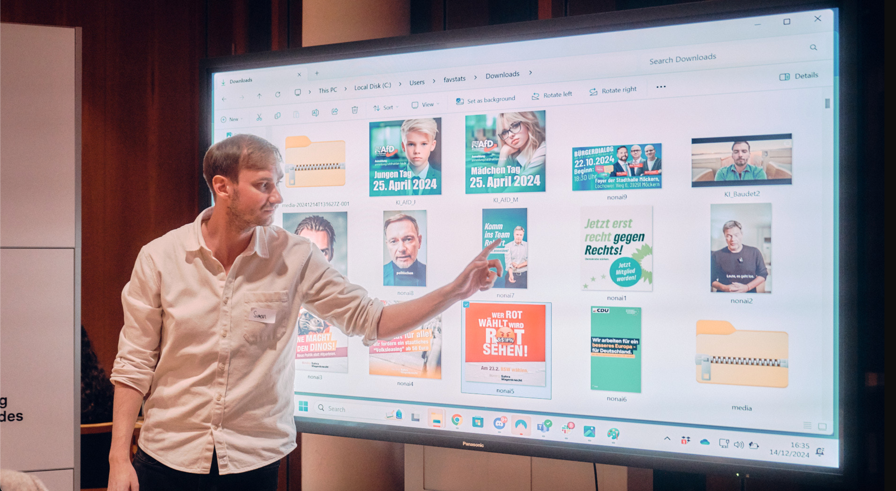
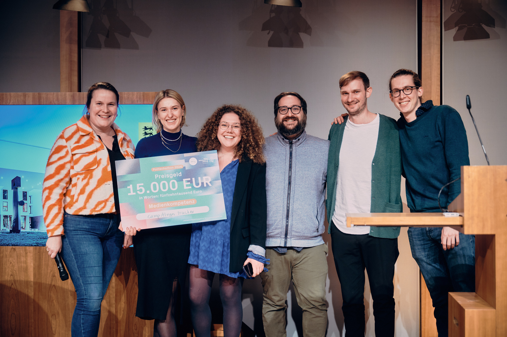

<!-- Custom CSS -->

# The CampAIgn Tracker for More Transparency in AI Use

Saturday morning, 9:00 a.m. in gray Berlin: full of expectations and anticipation, we each arrive at the festively lit Baden-Württemberg State Representation.  
We are **Dr. Simon Kruschinski** (Political Communication Researcher at Johannes Gutenberg University Mainz), **Miriam Runde** (M. Sc. Data Science for Public Policy), **Dr. Fabio Votta** (Postdoc Researcher in Data-Driven Campaigning at the University of Amsterdam), **Jakob Scherer** (M. Sc. Management) and **Theresa Schültken** (MA International Relations, Strategic Foresight Consultant).

When we first meet around 10:30 a.m., we immediately realize that the combination of **political science**, **data science**, and **AI expertise** provides a strong foundation for the weekend.  
Over the course of a weekend of parallel data preparation, testing possible AI models, persona research, and many insightful conversations, an idea turned into a project: **The CampAIgn Tracker.**

  

Credits @ BW Stiftung / Viktor Heekeren

## Background

In the context of the super election year 2024, the dangers of AI use in political debate were repeatedly discussed in the media and public sphere.  
The fear of **fake news**, **disinformation**, **emotionalization**, and **manipulation** is palpable and contributes to uncertainty – yet concrete evidence and a data basis on the extent to which AI is actually used in political campaigns on social media platforms is lacking.

This is where the **CampAIgn Tracker** comes in:  
It provides a platform to trace which image and video messages from political actors in Germany on social media were in fact generated with the help of AI.

> _"With the CampAIgn Tracker, we contribute significantly to the necessary transparency around the use of AI for generating visual content, helping people to discuss whether this use for dissemination on social media is legitimate or poses a potential risk."_  
> — **Dr. Simon Kruschinski**

## Development of the Prototype

At the **Politechathon**, a first prototype was created.  
The dataset included paid Facebook and Instagram posts from all federal and state parties in 2024.  
The first challenge was to find an **AI model capable of identifying AI-generated content** and test it with the dataset.

The CampAIgn Tracker relies on a **two-step process**:

1. **Automated detection** of AI-generated content.  
2. **Manual validation** by experts to increase accuracy.  

This ensures a very high level of accuracy in identifying AI-generated content – a key factor for the project’s acceptance.

## Outlook

On the website [www.campaigntracker.de](https://www.campaigntracker.de), in the future it will be possible to:

- View **AI-generated content** from over 3000 political actors in Germany  
- Access details on **interactions**, **spending**, and **reach**  
- Analyze individual AI messages with metadata  

## Our Success at the Politechathon

On Sunday afternoon came the big surprise:  
After pitching the project, we won **first place in the Media Literacy category** – including prize money for the further development of the CampAIgn Tracker.

Within 48 hours, an idea became a ready-to-use platform for promoting **transparency in election campaigns**.

> _"Conclusion: expand your network, develop an AI tool in the shortest possible time, and even win an award in the end – the Politechathon showed that with the right team spirit and some 'nerd power' (as the evening news so fondly put it), the unimaginable can happen in 48 hours."_  
> — **Miriam Runde**

  

Credits @ BW Stiftung / Viktor Heekeren

 

