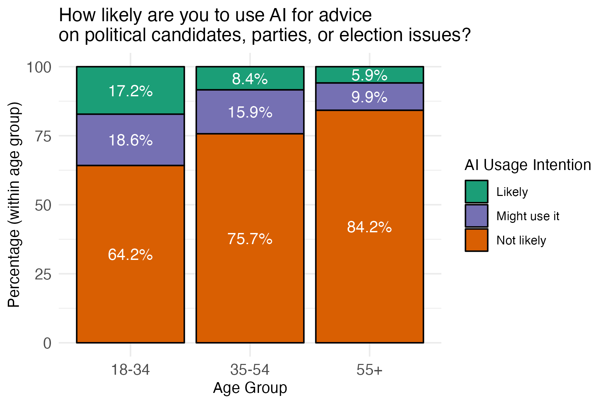

<!-- Custom CSS -->
```{=html}
<style>
.blog-post-content {
  font-family: "Helvetica Neue", Arial, sans-serif;
  line-height: 1.7;
  color: #333;
  background-color: #f9f9f9;
  padding: 30px;
  max-width: 900px;
  margin: 0 auto;
}
.blog-post-content h1, .blog-post-content h2, .blog-post-content h3 {
  color: #004080;
  margin-bottom: 0.8em;
  margin-top: 1.2em;
}
.blog-post-content h1 {
  text-align: center;
  font-size: 2.2em;
  margin-bottom: 0.3em;
}
.blog-post-content h2 {
  font-size: 1.6em;
  border-bottom: 2px solid #004080;
  padding-bottom: 0.3em;
}
.blog-post-content p {
  margin: 1em 0;
  text-align: justify;
}
.blog-post-content img {
  display: block;
  margin: 25px auto;
  max-width: 100%;
  border-radius: 8px;
  box-shadow: 0 4px 8px rgba(0,0,0,0.1);
}
.blog-post-content blockquote {
  font-style: italic;
  background: #f0f8ff;
  padding: 15px 20px;
  border-left: 4px solid #004080;
  margin: 20px 0;
  border-radius: 3px;
}
.blog-post-content .callout {
  background-color: #e7f3fe;
  padding: 20px;
  border-left: 5px solid #2196F3;
  margin: 25px 0;
  border-radius: 5px;
  font-size: 0.95em;
}
.blog-post-content .credit {
  font-size: 0.85em;
  color: #666;
  text-align: center;
  margin-top: -15px;
  margin-bottom: 20px;
  font-style: italic;
}
.blog-post-content strong {
  color: #004080;
}
.blog-post-content ul {
  margin: 1em 0;
  padding-left: 2em;
}
.blog-post-content li {
  margin: 0.5em 0;
}
</style>
<div class="blog-post-content">
```

## Would you trust an AI to tell you who to vote for?

When over 1,000 Dutch citizens were asked how likely they were to ask ChatGPT or another AI tool for advice on political candidates, parties, or election issues, the results were worrying:

- 77% said it's unlikely they'd do so
- 13% sat on the fence (a cautious "maybe")
- But **1 in 10 said they're likely to ask AI for voting advice**

If we extrapolate this to the general population, this means that roughly 1.8 million citizens nationwide could be asking an AI chatbot for advice. And given how people often underreport behaviors they think are "socially undesirable", the real number could be even higher.

This is what a survey fielded by the AlgoSoc Consortium (a collaboration of the University of Amsterdam, Utrecht University, TU Delft, Tilburg, Erasmus University Rotterdam) tells us. In the lead up to the elections, they asked 1,220 Dutch citizens how likely they were to ask ChatGPT or another AI chatbot tool for advice on political candidates, parties, or election issues.

The data, drawn from the LISS Panel of Centerdata, revealed pronounced differences across age groups in the likelihood of using AI for advice. Among respondents who were likely to use AI, 42.5% were under 34 years old, compared to only 19.2% of those unlikely to use AI. Conversely, older age groups were more represented among those not likely to use AI: 52.9% were 55 or older, while this age group accounted for just 31% of likely users.

{fig-align="center"}

<center>
*Figure shows how likely different age groups are to use AI for advice on candidates, parties, and election issues. We find that younger voters are more likely than older age groups to do so.*
</center>


## Why you shouldn't ask chatbots for advice

The Dutch Data Protection Authority (AP) recently [tested several chatbots against trusted tools like Kieskompas and StemWijzer](https://www.autoriteitpersoonsgegevens.nl/actueel/ap-waarschuwt-chatbots-geven-vertekend-stemadvies). The results were clear: these chatbots are not ready to guide voters.

According to the AP's October 2025 report: Chatbots "surprisingly often" give the same two parties, PVV or GroenLinks-PvdA, as the top match, regardless of what the user asks. In more than 56% of cases, one of these two came out on top. For one chatbot, that number was over 80%.

Meanwhile, parties like D66, VVD, SP, or PvdD barely appeared, and others (BBB, CDA, SGP, DENK) were practically invisible, even when the voter's positions matched theirs perfectly.

In other words, AI is biased and gets it completely wrong: 

> "Chatbots may seem like clever tools but as a voting aid, they consistently fail. Voters may unknowingly be steered toward parties that don't align with their views. This threatens the integrity of free and fair elections."

- AP vice-chair Monique Verdier

## AI chatbots can mislead late-deciding voters

Unlike official voting aids, chatbots are not designed for politics. Chatbot answers are generated from messy, unverifiable data scraped from across the internet, including social media and outdated news.

That means they can: 

- Mix up facts or misrepresent party positions.
- Reflect biases baked into their training data.
- And present all this as if it's objective truth.

So while a chatbot might sound confident, it's not necessarily correct.

This is worrying because voters often look for voting advice late in the campaign, when attention is high but time to reflect is short. [Research shows](https://www.tandfonline.com/doi/full/10.1080/19331681.2014.958794?casa_token=WoYcR9tcC7EAAAAA%3AfK3r4Rlt4yHMTZRKaPFFVho92F21RO1dx53FFBGqs1ATir_xdg-maXzWZGtU8aTdzHeRx-cC-3cr) that many people turn to tools like StemWijzer or Kieskompas just days before an election (Van de Pol et al 2014). It's reasonable to expect the same pattern for AI chatbots, except these tools aren't designed, tested, or transparent enough to handle that responsibility.

So, if you're on your way to the polls tomorrow… maybe don't stop to ask ChatGPT, "Who should I vote for?"

## Many Dutch people share these concerns

It's not just experts raising the alarm: the public is also concerned too. In our survey, nearly seven in ten (69.2%) Dutch citizens said they are worried about others receiving incorrect political information from AI tools.

This shows that most people understand the risks: chatbots might sound smart, but they're not neutral, and their influence can quietly distort how voters see the political landscape.

## What you can do instead

If you're curious about which party aligns with your views, skip the chatbot detour and use verified, transparent sources:

🗳️ **StemWijzer or Kieskompas**: independent, evidence-based, and audited tools.

📰 **Reputable journalistic sources** that check their facts.

🗣️ **Or go straight to the original sources**: party manifestos and official websites.


```{=html}
</div>
```