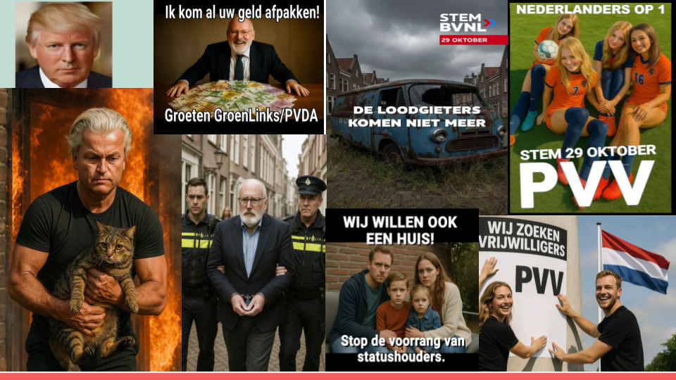
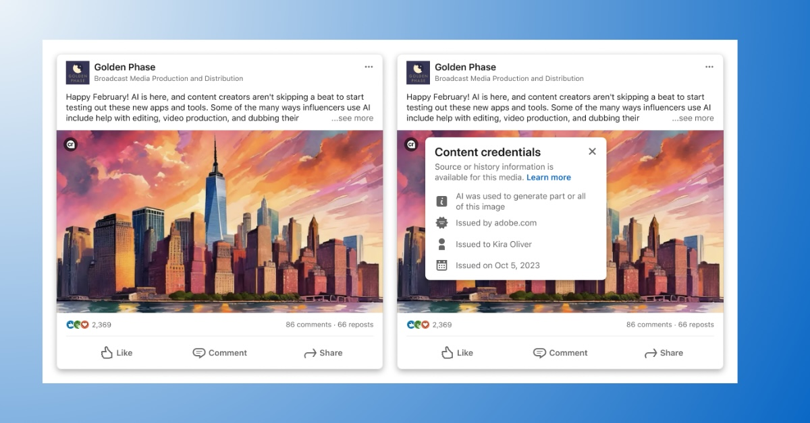

<!-- Custom CSS -->
```{=html}
<style>
.blog-post-content {
  font-family: "Helvetica Neue", Arial, sans-serif;
  line-height: 1.7;
  color: #333;
  background-color: #f9f9f9;
  padding: 30px;
  max-width: 900px;
  margin: 0 auto;
}
.blog-post-content h1, .blog-post-content h2, .blog-post-content h3 {
  color: #004080;
  margin-bottom: 0.8em;
  margin-top: 1.2em;
}
.blog-post-content h1 {
  text-align: center;
  font-size: 2.2em;
  margin-bottom: 0.3em;
}
.blog-post-content h2 {
  font-size: 1.6em;
  border-bottom: 2px solid #004080;
  padding-bottom: 0.3em;
}
.blog-post-content p {
  margin: 1em 0;
  text-align: justify;
}
.blog-post-content blockquote {
  font-style: italic;
  background: #f0f8ff;
  padding: 15px 20px;
  border-left: 4px solid #004080;
  margin: 20px 0;
  border-radius: 3px;
}
.blog-post-content .callout {
  background-color: #e7f3fe;
  padding: 20px;
  border-left: 5px solid #2196F3;
  margin: 25px 0;
  border-radius: 5px;
  font-size: 0.95em;
}
.blog-post-content strong {
  color: #004080;
}
</style>
<div class="blog-post-content">
```

Generative AI is used in many ways in modern election campaigns, ranging from simple help with research tasks and translations to generate persuasive messages for voter outreach.  However, one of the biggest concerns is that the advent of generative AI may contribute to the spread of *visual* disinformation, that is, **inauthentic images that are created and disseminated with the intention to deceive**. For the last few years, hyperrealistic deepfakes were considered the biggest danger in this context. The anticipated worst-case scenario was that a convincing fake video could appear days before an election, [shifting public opinion about a politician before fact-checkers could react](https://heinonline.org/HOL/Page?collection=journals&handle=hein.journals/calr107&id=1790&men_tab=srchresults). Soon, we would not be able to ["believe anythig we see."](https://www.nytimes.com/2019/06/10/opinion/deepfake-pelosi-video.html) However, for the longest time, deepfakes or anything of the like were difficult to make and barely looked convincing. They rarely appeared in political contexts, and no verified case ever changed the outcome of an election.

Now things have changed. On the CampAIgn Tracker we're seeing a large and growing number of AI-generated images and videos across platforms. The vast majority are real-looking, resembling actual photographs and videos rather than drawings or cartoons. This means that there is a possibility that we might (still) encounter *the* smoking AI gun that tricks everyone and changes the election outcome overnight. But what is perhaps most interesting about the images is not their volume or lifelike quality. It's the kind of content they show, and how it challenges long-held assumptions in disinformation research. Specifically, it seems like the images from the Dutch campaign are not primarily intended to deceive, but rather to illustrate on the one hand or to provoke, entertain, or ridicule, feeding into propagandistic narratives on the other hand. Some depict political figures in exaggerated or absurd settings. Some blend realism and symbolism: a leader portrayed as a superhero, or an opponent depicted as a criminal. Some are just playful memes.

{fig-align="center"}
<center>
*Some example sof AI imagery as monitored by the CampAIgn Tracker.*
</center>

This challenges how researchers have long conceptualized the dangers of synthetic media in a disinformation context. Much of the early debate assumed a relatively simple causal chain: *realistic fake → people believe it → false beliefs spread*. But, as is often the case, things are a bit more complicated than that. Indeed, it can be challenging to distinguish artificial from real visual content. But research also shows that people are often quite good at recognizing if an image or video is fake, which is likely also the case with much of the content found in the CampAIgn Tracker. For instance, it is probably clear to most people that Geert Wilders did not really carry a cat or a child out of a burning building. But that doesn't necessarily mean that these images have no influence. Our research shows (soon to be published) that the message of an image can stick even when its authenticity is doubted. Specifically, a deepfake that is rated unbelievable can still reinforce an existing stereotype or bias towards a politician. Additionally, [psychology research shows that images have a particularly powerful impact on memory](https://link.springer.com/article/10.3758/MC.37.4.414), and it doesn't even matter whether they are deemed credible in the moment of encounter or not. This suggests that doctored images can shape beliefs and attitudes in the long run, which may even amplify through repeated exposure, such as seeing a similar image time and time again.

{fig-align="center"}

<center>
*Content credentials are part of the [Content Authenticity Initiative (CAI)](https://contentauthenticity.org/), a global standard to help verify the origin and authenticity of digital content.*
</center>

Another insight from the CampAIgn Tracker is that AI-generated images spread across platforms, and that the use of AI mostly remains undisclosed. Yet, labelling content that is AI-generated is considered an essential [measure against visual disinformation in the EU](https://www.europarl.europa.eu/thinktank/de/document/EPRS_BRI(2023)757583). Labels or watermarks can ensure transparency in content creation, thus aid fact-checkers and social media users to identify where content originated. However, experiments testing the effectiveness of such labels to correct false beliefs in citizens offer mixed findings, generally demonstrating that their impact is limited. We find that they can work, but that this is very much context-dependent. For instance, [in a recent study](https://osf.io/preprints/osf/8237p_v1) we show that social media posts containing AI-generated disinformation with the topic immigration lose credibility when paired with a community note stating that the information is false.

Overall, it appears as if **the long-predicted deepfake era has arrived, but not quite in the form we feared**. This invites researchers, journalists and policymakers alike to rethink what exactly makes such content problematic. Rather than focusing solely on deception and false beliefs, we need to consider how AI-generated visuals feed into political propaganda, strengthen existing political attitudes, reinforce stereotypes or simply contribute to meme culture. Beyond that, we need to ask whether our go-to fixes like fact-checks and similar measures still work, or if we need to go back to the drawing board on how we deal with this content.

*Written by [Teresa Weikmann](https://www.uva.nl/en/profile/w/e/t.e.weikmann/t.e.weikmann.html), Postdoctoral Researcher at the University of Amsterdam ([BENEDMO](https://benedmo.eu/) , [AI, Media, and Democracy Lab](https://www.aim4dem.nl/))*


```{=html}
</div>
```