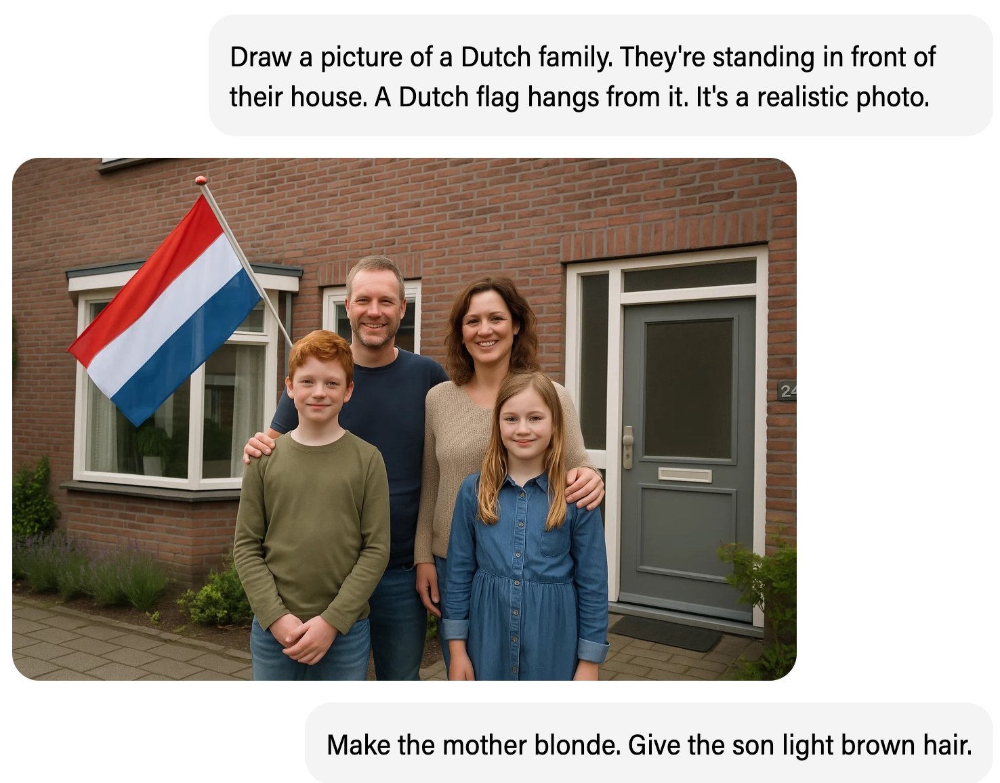
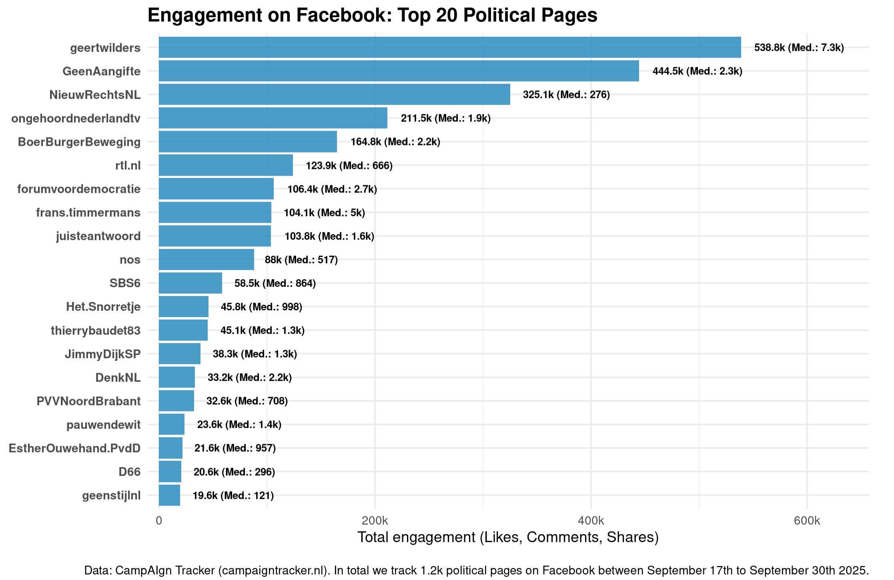
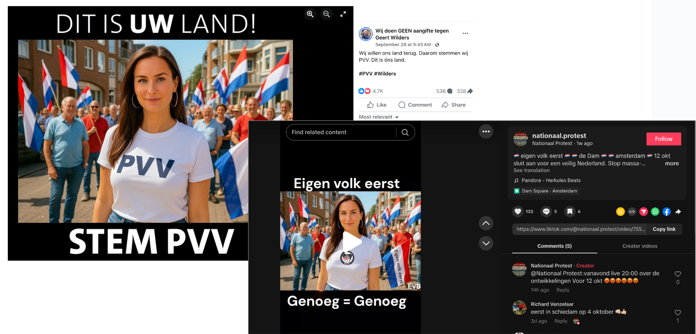
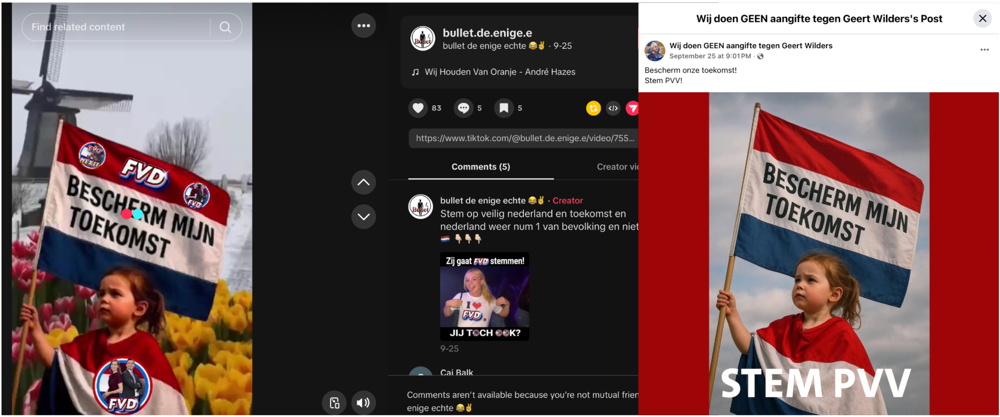

<!-- Custom CSS -->
```{=html}
<style>
.blog-post-content {
  font-family: "Helvetica Neue", Arial, sans-serif;
  line-height: 1.7;
  color: #333;
  background-color: #f9f9f9;
  padding: 30px;
  max-width: 900px;
  margin: 0 auto;
}
.blog-post-content h1, .blog-post-content h2, .blog-post-content h3 {
  color: #004080;
  margin-bottom: 0.8em;
  margin-top: 1.2em;
}
.blog-post-content h1 {
  text-align: center;
  font-size: 2.2em;
  margin-bottom: 0.3em;
}
.blog-post-content h2 {
  font-size: 1.6em;
  border-bottom: 2px solid #004080;
  padding-bottom: 0.3em;
}
.blog-post-content p {
  margin: 1em 0;
  text-align: justify;
}
.blog-post-content blockquote {
  font-style: italic;
  background: #f0f8ff;
  padding: 15px 20px;
  border-left: 4px solid #004080;
  margin: 20px 0;
  border-radius: 3px;
}
.blog-post-content .callout {
  background-color: #e7f3fe;
  padding: 20px;
  border-left: 5px solid #2196F3;
  margin: 25px 0;
  border-radius: 5px;
  font-size: 0.95em;
}
.blog-post-content strong {
  color: #004080;
}
</style>
<div class="blog-post-content">
```


Investigative journalism by [*De Groene Amsterdammer*](https://www.groene.nl/artikel/maak-haar-blond-onschuldig-en-knap) has documented coordinated use of photorealistic AI imagery in Dutch political messaging, tracing the practice to members of parliament. The investigation is particularly valuable because it goes beyond visible outputs and recovers **the actual prompts used to generate these images**, offering rare insight into how synthetic media is engineered for political messaging. With support from the CampAIgn Tracker, we provided additional evidence on where this content travels and how it is amplified.  

{fig-align="center"}

<center>
*Prompting revealed by the Groene Amsterdammer in their article. Translated by CampAIgn Tracker.*
</center>

Our research team identified the main PVV-aligned page responsible for this content (GeenAangifte) as **one of the most active generators of AI campaign material we have tracked across platforms**. On Facebook, the page consistently ranks among the **top most engaged accounts**, with engagement comparable to many national politician and party pages and just shy of the total engagement on **Geert Wilders's page**. 

{fig-align="center"}

<center>
*Pages with most total Engagement on Facebook as monitored by the CampAIgn Tracker.*
</center>


Indeed, what is notable is not just the volume but the **distribution** as well: images likely originating from this source appear across multiple other far-right-leaning accounts on Facebook, Instagram, and TikTok. This reflects both the success of AI-generated political content at scale and the strong networking effects within the far-right online sphere.

{fig-align="center"}

<center>
*Page for Anti-Immigration Protest in Amsterdam rehashing AI-generated Imagery* 
</center>

<br>

{fig-align="center"}

<center>
*Other Party Fan Accounts also like to use imagery from the PVV-aligned Page and brand it with their own logos*
</center>


Among 4,000 accounts we monitor across platforms, PVV-affiliated pages stand out in their systematic use of photorealistic AI imagery as campaign material. Their scale and reach is unmatched by (mainstream) parties and mostly just recycled and rebranded by other far-right actors.


---

**Read the full investigation:** [*De Groene Amsterdammer* - "Maak haar blond, onschuldig en knap"](https://www.groene.nl/artikel/maak-haar-blond-onschuldig-en-knap)

```{=html}
</div>
```