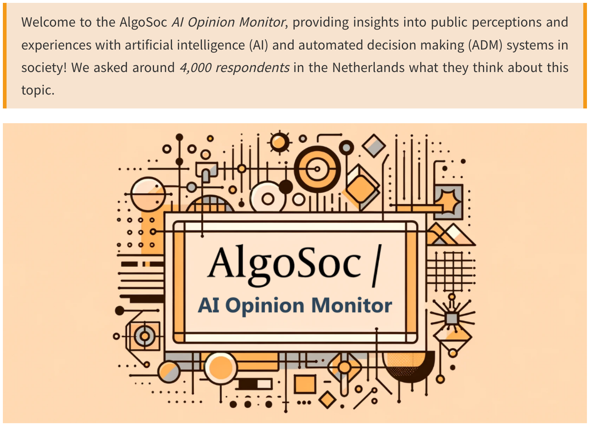
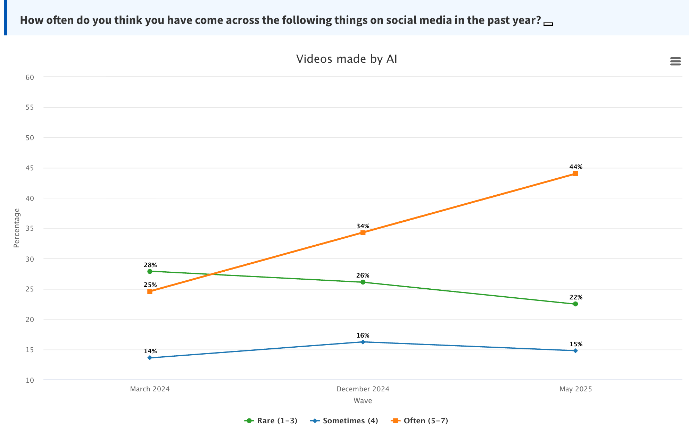
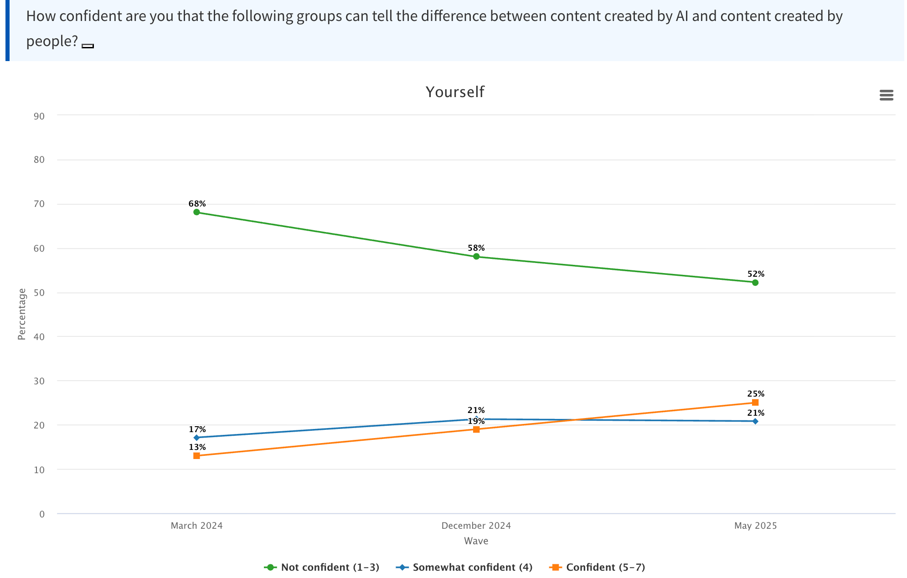
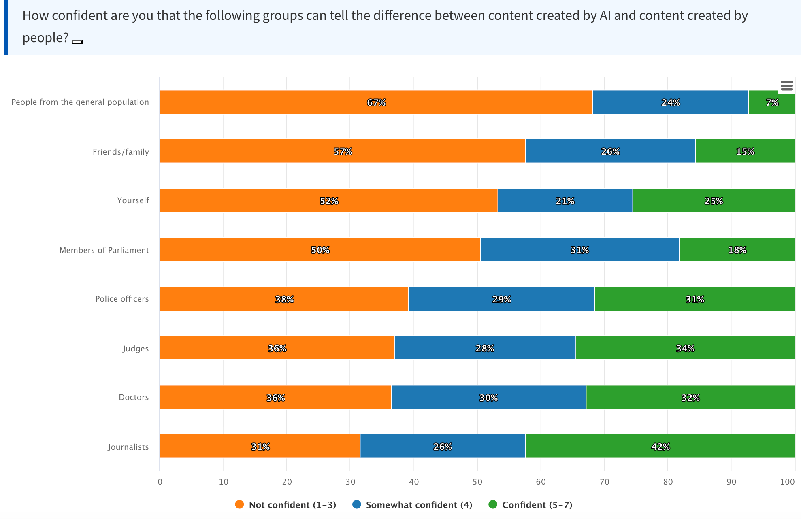
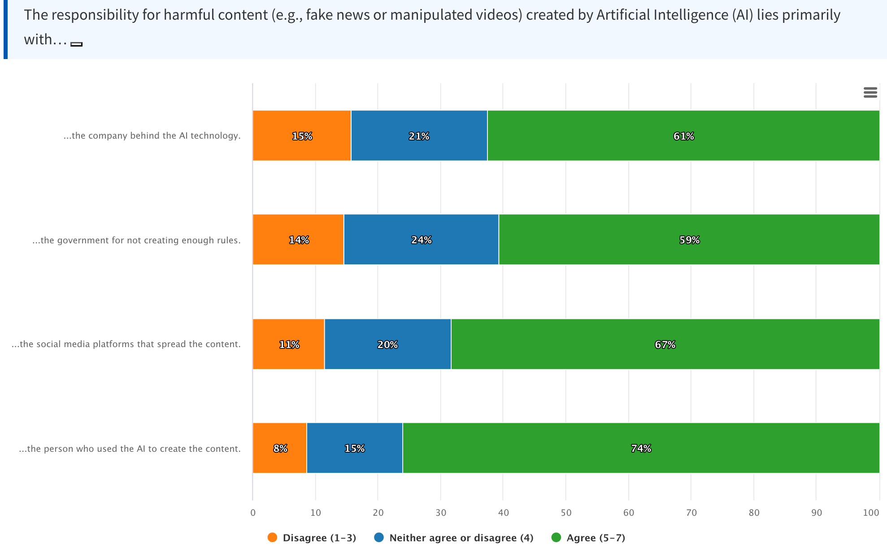

```{=html}
<style>
.blog-post-content {
  font-family: "Helvetica Neue", Arial, sans-serif;
  line-height: 1.6;
  color: #333;
  background-color: #f9f9f9;
  padding: 20px;
}
.blog-post-content h1, .blog-post-content h2, .blog-post-content h3 {
  text-align: center;
  color: #004080;
  margin-bottom: 0.5em;
}
.blog-post-content p {
  text-align: justify;
  margin: 1em 0;
}
.blog-post-content img {
  display: block;
  margin: 20px auto;
  max-width: 100%;
  border-radius: 10px;
  box-shadow: 0 4px 8px rgba(0,0,0,0.1);
}
.blog-post-content blockquote {
  font-style: italic;
  background: #f0f8ff;
  padding: 15px;
  border-left: 4px solid #004080;
  margin: 20px 0;
}
.blog-post-content .callout {
  background-color: #e7f3fe;
  padding: 15px;
  border-left: 5px solid #2196F3;
  margin: 20px 0;
  border-radius: 5px;
}
.blog-post-content .credit {
  font-size: 0.9em;
  color: #555;
  text-align: center;
  margin-top: -10px;
}
</style>

<div class="blog-post-content">
```


> How Confident are people in the Netherlands in their ability to detect AI?


{fig-align="center"}

While the CampAIgn Tracker sheds light on what kind of AI-generated images and videos circulate ahead of the 2025 Parliamentary election, the [AI Opinion Monitor](https://monitor.algosoc.org/en/) (developed by the [AlgoSoc Consortium](https://algosoc.org/)) reveals how citizens themselves experience and understand this shift. The monitor adds important context to the CampAIgn Tracker by showing how people in the Netherlands perceive and navigate the growing presence of AI in public life. For the past two years, it has followed among other things, changes in how often people encounter AI-generated content, how confident they feel in recognizing it, and who they think should be held responsible for it.


{fig-align="center"}

<center>
Figure 1: Exposure to AI-generated content (March 2024–May 2025)
</center>


Our most recent findings show a sharp rise in exposure to AI-generated video—technology that was until recently niche but is now widely accessible, for example via OpenAI's [Sora text-to-video model](https://www.washingtonpost.com/technology/2025/10/07/sora-cameo-deepfake-consent/). In our AI Opinion Monitor we find that the share of people who say they *often* see AI-generated videos nearly doubled, from **25% in March 2024 to 44% in May 2025** (*Figure 1*). For AI-generated images, the increase is even sharper, from **24% to 53%**. Encounters are most common among younger citizens: **76%** of those aged 16–29 report frequently seeing AI-generated content. Political orientation also plays a role, with **61% of left-leaning** respondents versus **53% of right-leaning** respondents saying they see such material often.


{fig-align="center"}

<center>
Figure 2: People's confidence in themselves to detect AI-generated content (March 2024–May 2025).
</center>

As shown in *Figure 2*, while exposure has grown, people's *confidence* in spotting AI content has not collapsed in the way many would have feared, in fact the opposite seems to be the case: people have increasingly become more confident in their ability to detect AI-generated content. In 2024, a large majority of **68%** said they were *not confident* in their ability to detect AI. By mid-2025, that figure dropped to **52%**.


{fig-align="center"}

<center>
Figure 3: Confidence in detecting AI-generated content (May 2025).
</center>


Still, skepticism about others' ability remains widespread. **Journalists** are the most trusted group to recognize AI content, but even here, only **27%** of respondents express confidence (Figure 3). Trust is lowest in the general public: **76%** say they don't trust ordinary people to detect AI—followed by **friends and family (69%)**.


{fig-align="center"}

<center>
Figure 4: Who is responsible for harmful AI content? (May 2025).
</center>

And when it comes to accountability (Figure 4), most Dutch citizens point the finger at *those who create the content*: **74%** believe the individual who made the AI-generated material should be held responsible. Still, **67%** also blame *social media platforms* for allowing such content to spread, and **59%** say the *government* bears some responsibility for not preventing or regulating it.

Check out and follow the Dutch [AI Opinion Monitor](https://monitor.algosoc.org/en/) to play around with the data and get more in-depth insights yourself!

*Written by [Ernesto de León](https://www.uva.nl/en/profile/l/e/e.e.de-leon-williams/e.e.de-leon-williams.html), Postdoctoral Researcher at the University of Amsterdam ([AlgoSoc Consortium](https://algosoc.org/))*

```{=html}
</div>
```