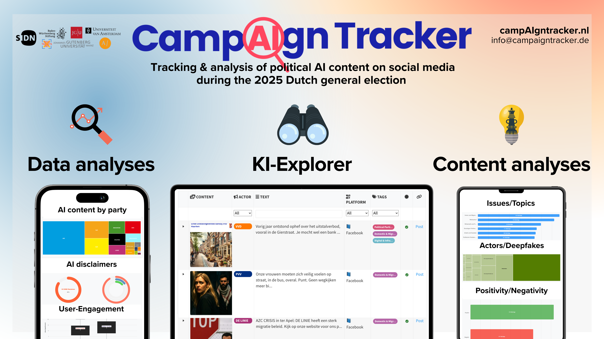

<!-- Custom CSS -->

```{=html}
<style>
.blog-post-content {
  font-family: "Helvetica Neue", Arial, sans-serif;
  line-height: 1.6;
  color: #333;
  background-color: #f9f9f9;
  padding: 20px;
}
.blog-post-content h1, .blog-post-content h2, .blog-post-content h3 {
  text-align: center;
  color: #004080;
  margin-bottom: 0.5em;
}
.blog-post-content p {
  text-align: justify;
  margin: 1em 0;
}
.blog-post-content img {
  display: block;
  margin: 20px auto;
  max-width: 100%;
  border-radius: 10px;
  box-shadow: 0 4px 8px rgba(0,0,0,0.1);
}
.blog-post-content blockquote {
  font-style: italic;
  background: #f0f8ff;
  padding: 15px;
  border-left: 4px solid #004080;
  margin: 20px 0;
}
.blog-post-content .callout {
  background-color: #e7f3fe;
  padding: 15px;
  border-left: 5px solid #2196F3;
  margin: 20px 0;
  border-radius: 5px;
}
.blog-post-content .credit {
  font-size: 0.9em;
  color: #555;
  text-align: center;
  margin-top: -10px;
}
</style>

<div class="blog-post-content">
```


Following successful deployment during Germany's 2025 federal election, the [CampAIgn Tracker](https://www.campaigntracker.de/) launches in the Netherlands to monitor AI-generated content across political campaigns ahead of the October 29, 2025 Dutch general election. We joined forces with [Stichting Post-X Society](https://postxsociety.nl/), [Trollrensics](https://trollrensics.com/), [AI Forensics](https://aiforensics.org/), and [Justice for Prosperity](https://justiceforprosperity.org/) within the Hybrid Election Integrity Observatory Consortium, a collaborative network formed specifically to monitor digital spaces during the Dutch election. This expansion represents a significant step in our mission to bring transparency to digital campaigning across Europe.

As the October 29 election approaches, the CampAIgn Tracker will provide ongoing monitoring of how political actors across the Dutch political spectrum employ AI-generated content. The platform will update regularly as new content appears, allowing journalists and researchers to track developments throughout the campaign period.

We invite journalists, researchers, and interested citizens to explore the tracker at [https://www.campaigntracker.nl/](https://www.campaigntracker.nl/) and to contact us with questions or observations about patterns they identify in the data.

## What is the CampAIgn Tracker?

The CampAIgn Tracker is a research tool designed to identify and analyze AI-generated images and videos published by political actors on social media platforms. In an era where synthetic media becomes increasingly sophisticated and accessible, political parties and campaigns can produce content that appears photographic or video-recorded but is entirely computer-generated. Our tracker systematically detects these materials and makes them publicly accessible.

The tool serves two primary audiences. Journalists can use the platform to investigate how political actors employ AI-generated content in their messaging strategies. Citizens gain access to information about which parties use synthetic media, how frequently they deploy it, and whether they properly label such content as AI-generated. This transparency becomes particularly important as AI tools lower the barrier to creating convincing but fabricated imagery.

Beyond simple detection, the tracker analyzes patterns in AI usage. We examine which topics are most commonly illustrated with synthetic imagery, whether positive or negative messaging dominates AI-generated content, and how labeling practices vary across parties and platforms. These analyses reveal strategic choices in digital campaigning that would otherwise remain invisible to the public.

Access the Dutch version at: [https://www.campaigntracker.nl/](https://www.campaigntracker.nl/)


## New Features for the Dutch Election

The Netherlands deployment introduces several technical and analytical enhancements that substantially expand the tracker's capabilities beyond the German version.




**Platform expansion:** The original German tracker monitored Facebook and Instagram, the two platforms that provide the most comprehensive political advertising transparency through Meta's Ad Library. For the Dutch election, we expanded coverage to include TikTok and Twitter/X. This addition reflects the changing landscape of political communication, where younger voters increasingly consume political content on TikTok, and Twitter/X remains a central platform for political discourse despite recent changes to the platform. Monitoring four platforms provides a more complete picture of how AI-generated content circulates across the digital ecosystem.

**Broader actor coverage:** The German version focused exclusively on political parties and their official candidates. However, political communication increasingly occurs through informal channels. For the Dutch tracker, we extended our monitoring to include political commentators who shape public opinion, influencers who bring political messages to younger demographics, fan pages that amplify party messaging, and meme pages that use humor and satire to engage with political topics. This expanded scope recognizes that modern campaigns operate through networks of affiliated actors rather than centralized party accounts alone.

**Enhanced AI Explorer:** We completely redesigned the interface that allows users to browse detected AI-generated content.  The new AI Explorer ([https://www.campaigntracker.nl/explore/](https://www.campaigntracker.nl/explore/)) provides multiple filtering dimensions. Users can filter by specific actors to see how individual parties or commentators use AI. Platform filters allow comparison of content strategies across Facebook, Instagram, TikTok, and Twitter/X. Topic filters enable investigation of which policy issues are most commonly illustrated with synthetic imagery. AI labeling filters distinguish between content that political actors properly marked as AI-generated and content that carries no such disclosure. Users can also search through the text accompanying posts to find specific terms or phrases.

**Deepfake detection:** One of the most concerning applications of AI in political campaigns involves creating synthetic content that appears to show real persons or real events. The Dutch tracker integrates analysis to identify whether AI-generated images depict recognizable public figures, simulate actual locations, or recreate historical moments. This deepfake detection capability flags content that poses particular risks for misinformation, as viewers may believe they are seeing documentary evidence of something that never occurred.

**Extended image classification:** Our content analysis framework now includes categories that proved important in preliminary research. The nostalgia/historic imagery category captures AI-generated content that evokes past eras or recreates historical scenes, often used to connect contemporary political messages with national memory or heritage. The humor/satire category identifies content that uses AI to create absurd or exaggerated scenarios for comedic or critical effect. These categories help distinguish between AI applications intended to deceive and those used transparently for creative communication.

The expansion to the Netherlands represents a test case for scaling the tracker to additional countries. The technical and methodological enhancements developed for the Dutch context create a foundation for potential deployment in future European elections. Each implementation generates insights that improve our detection methods and analytical frameworks.

## Partnership and Funding

This expansion occurs through the Hybrid Election Integrity Observatory (HEIO) Consortium, a collaborative network formed specifically to monitor the Dutch election. The consortium brings together organizations with complementary expertise in different aspects of digital campaigning and election integrity.


### Funding sources:

Two institutions provide financial support that made this expansion possible.


### University of Amsterdam:

> The Research Priority Area "[AI & Politics](https://aissr.uva.nl/our-research/artificial-intelligence-politics.html)" at the Amsterdam School of Communication Research awarded a seed grant for this project. The RPA represents a five-year initiative examining how AI reconfigures political dynamics, with annual funding of €250,000 supporting interdisciplinary research. The RPA addresses four key dimensions: investigating AI's impact on politics, analyzing the politics of AI governance, examining how AI systems perform traditional administrative functions, and understanding when and why AI use becomes politicized. Our project aligns with the RPA's mission by generating empirical evidence about how AI transforms political communication during elections. The seed grant specifically aims to integrate research across communication science, sociology, political science, and geography that currently remains dispersed across departmental boundaries. By bringing together scholars from these different disciplines, the funding program enables comprehensive analysis of the interconnections between different aspects of the AI-politics relationship.

### SIDN Fund:

>The second funding source comes from [SIDN Fund](https://www.sidnfonds.nl/), which supports projects contributing to a strong internet, empowered internet users, or research on the internet's significance for public values. SIDN Fund operates in three areas: strengthening the internet as an open, free, and trusted infrastructure; empowering adults, young people, and children with skills for safe and confident internet use; and promoting public values while counteracting negative internet effects. The fund supports initiatives addressing cybersecurity, data autonomy, disinformation, and digital accessibility within Dutch society. Our project fits within SIDN Fund's mission by addressing disinformation risks and promoting digital literacy regarding AI-generated content. The fund specifically prioritizes projects with impact on Dutch society, making the Dutch election tracker a natural fit for their support.


```{=html}
</div>
```