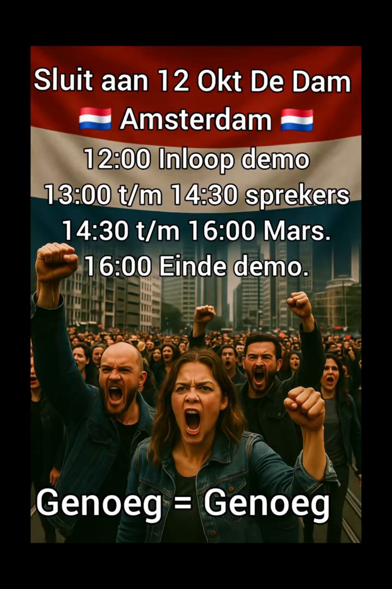
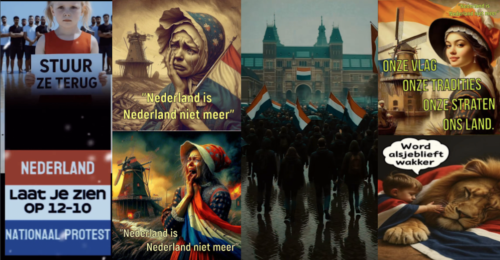

<!-- Custom CSS -->
```{=html}
<style>
.blog-post-content {
  font-family: "Helvetica Neue", Arial, sans-serif;
  line-height: 1.7;
  color: #333;
  background-color: #f9f9f9;
  padding: 30px;
  max-width: 900px;
  margin: 0 auto;
}
.blog-post-content h1, .blog-post-content h2, .blog-post-content h3 {
  color: #004080;
  margin-bottom: 0.8em;
  margin-top: 1.2em;
}
.blog-post-content h1 {
  text-align: center;
  font-size: 2.2em;
  margin-bottom: 0.3em;
}
.blog-post-content h2 {
  font-size: 1.6em;
  border-bottom: 2px solid #004080;
  padding-bottom: 0.3em;
}
.blog-post-content p {
  margin: 1em 0;
  text-align: justify;
}
.blog-post-content img {
  display: block;
  margin: 25px auto;
  max-width: 100%;
  border-radius: 8px;
  box-shadow: 0 4px 8px rgba(0,0,0,0.1);
}
.blog-post-content blockquote {
  font-style: italic;
  background: #f0f8ff;
  padding: 15px 20px;
  border-left: 4px solid #004080;
  margin: 20px 0;
  border-radius: 3px;
}
.blog-post-content .callout {
  background-color: #e7f3fe;
  padding: 20px;
  border-left: 5px solid #2196F3;
  margin: 25px 0;
  border-radius: 5px;
  font-size: 0.95em;
}
.blog-post-content .credit {
  font-size: 0.85em;
  color: #666;
  text-align: center;
  margin-top: -15px;
  margin-bottom: 20px;
  font-style: italic;
}
.blog-post-content strong {
  color: #004080;
}
</style>
<div class="blog-post-content">
```

Our CampAIgn Tracker shows how far-right actors are increasingly employing generative Artificial Intelligence (A.I.) imagery as a tool for political mobilisation in order to persuade as many people as possible to join the far-right anti-immigration protests in The Hague and Amsterdam. These fake images tend to blend themes of nostalgia and an idyllic past with dystopia. The dystopian future theme often leans on ideas of an immigrant 'invasion' and is engulfed with anti-immigrant rhetoric. This theme is deployed to rile up feelings of anger and fear, specifically following the murder of Lisa in Abcoude where the suspect is believed to be an asylum seeker.

{fig-align="center"}

<center>
*Call for protest shared by the original TikTok account announcing the protests on Oct. 12th in Amsterdam.*
</center>


On the other hand, the A.I. images hyperbolise the past as a utopia without immigrants. These images show excessive displays of Dutch flags, children draped in the national colours and often incorporate pompous music. In addition, many reference the Verenigde Oostindische Compagnie (VOC) era, or the so-called 'Golden Age', evoking pride and a sense of lost glory. The central idea of these images is that the external threat to, and blame for, the fall from grace is immigration. The patriotic tone of the imagery provokes a sense of obligation to defend the future of their country, and permits them to feel like victims of an 'invasion' of immigrants. We have seen this used as a political strategy for the parties and fan accounts of the Partij voor de Vrijheid (PVV) and Forum voor Democratie (FvD). This aesthetic of visual propaganda is spreading rapidly and obtaining thousands of likes. In October, AI images were circulated by far-right groups to help organise a far-right anti-immigration protest. Notably, the protest on the 20th of September 2025 quickly escalated into a large-scale riot where Prince's Flags, previously used as a symbol for the Nationaal-Socialistische Beweging (NSB), were on display, including versions with the VOC logo on them. This highlights how dangerous these A.I. images are as they can be weaponised to fuel extremist violence.


{fig-align="center"}

<center>
*AI Imagery shared by Anti-Immigration Protest Accounts.*
</center>

As the Netherlands prepares for the upcoming elections, we see this increasingly being done by fan accounts campaigning for far-right parties. Besides, in virtually every case for promoting these far-right protests, the accounts tend to not use any sort of label or identifier on the A.I. imagery. Thus, these elections are serving as a launchpad for truthful and fair political campaigning to become obsolete. Interestingly, since the start of our research, media platforms have suspended several of these accounts, for instance, the original account calling for the October 12th protests in Amsterdam on TikTok. However, the rise of A.I.-driven propaganda has surfaced extreme right-wing rhetoric and normalised its presence in mainstream politics. This underscores the need for A.I. transparency and digital literacy.

*Written by [Doortje Cools](https://www.linkedin.com/in/dorothea-cools-38b6542a1/?originalSubdomain=nl), Master Student at the University of Amsterdam and Research Assisstant for the CampAIgn Tracker Project*


```{=html}
</div>
```


